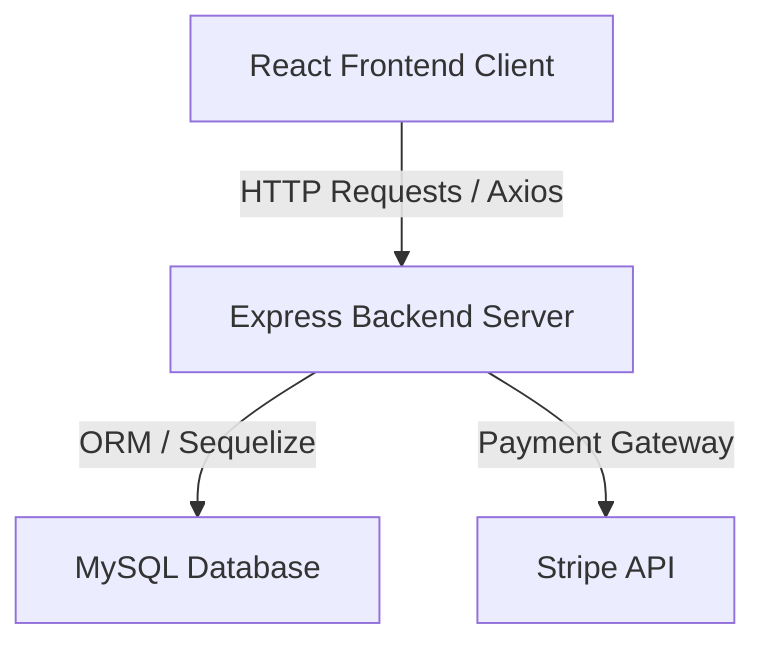

# Studio Evelyn - PI4 Project

[](https://reactjs.org/)
[](https://nodejs.org/)
[](https://www.mysql.com/)

## Table of Contents

- [Context](#-context)
- [Software features](#-software-features)
- [Technologies and tools](#-technologies-and-tools)
- [Architecture](#-architecture)
- [Repository structure](#-repository-structure)
- [Requirements](#-requirements)
- [How to run](#-how-to-run)
- [Author](#-author)

# 📌 Context 

This is the online scheduling and booking system project for the beauty salon **Glam** (Studio Evelyn), developed during the 4th semester's Integrated Project (PI4) of the Information Systems degree. It allows clients to schedule dynamic beauty procedures and pay online, while offering the shop owner an administrative panel to review and confirm bookings.

## 🚀 Software features

- **Client Registration & Login:** User account authentication for salon clients.
- **Procedure Scheduling:** Interactive appointment booking system with date and time selectors.
- **Stripe Payments:** Integrated online checkout capabilities via Stripe API.
- **Merchant Dashboard:** Administrative panel for the salon owner to view, manage, and approve schedules.

## 🛠️ Technologies and tools

- **Backend:**
  - Node.js & Express.js (REST API engine)
  - MySQL & Sequelize (Database storage and ORM model mapping)
- **Frontend:**
  - React (UI component library)
  - Axios (HTTP client API integration)
  - React Router DOM (Single Page Application routing)
  - Styled Components (Modular CSS styling)

## 📋 Architecture



## 📂 Repository structure

```text
- 📂 monorepo-studio-evelyn-pi4/
  - 📂 backend/ (Node.js API application)
    - 📄 Glam.sql (MySQL database schema creation script)
    - 📄 .env.copy (Credential environment template)
    - 📄 package.json
    - 📂 src/ (Controllers, models, and routes configuration)
  - 📂 frontend/ (React client layout)
    - 📄 package.json
    - 📂 src/ (Pages, styling, and services)
```

## 📦 Requirements

- Node.js v18 or higher
- npm or yarn package manager
- MySQL Server & MySQL Workbench

## ⚙️ How to run

### 1. Clone the Repository
Clone the repository to your local machine:
```bash
git clone https://github.com/MatheusRodri/monorepo-studio-evelyn-pi4.git
cd monorepo-studio-evelyn-pi4
```

### 2. Set Up the Backend Server
1. Navigate to the backend directory:
   ```bash
   cd backend
   ```
2. Install the required Node packages:
   ```bash
   npm install
   ```
3. Initialize the database schema:
   - Connect to your local MySQL database using **MySQL Workbench**.
   - Open and execute the `Glam.sql` script located in the `backend/` directory to create all tables.
4. Configure credentials:
   - Copy `.env.copy` to `.env`:
     ```bash
     mv .env.copy .env
     ```
   - Open `.env` and fill in your local MySQL port, username, password, and Stripe API keys.
5. Run the server:
   ```bash
   npm start
   ```

### 3. Set Up the Frontend Client
1. Open a new terminal window/tab and navigate to the frontend directory:
   ```bash
   cd ../frontend
   ```
2. Install the required UI packages:
   ```bash
   npm install
   ```
3. Run the React development server:
   ```bash
   npm start
   ```
4. Access `http://localhost:3000` in your web browser.

## 👤 Author

Matheus Rodrigues 
[LinkedIn](https://linkedin.com/in/matheus-rodrigues-mrj) [GitHub](https://github.com/MatheusRodri)